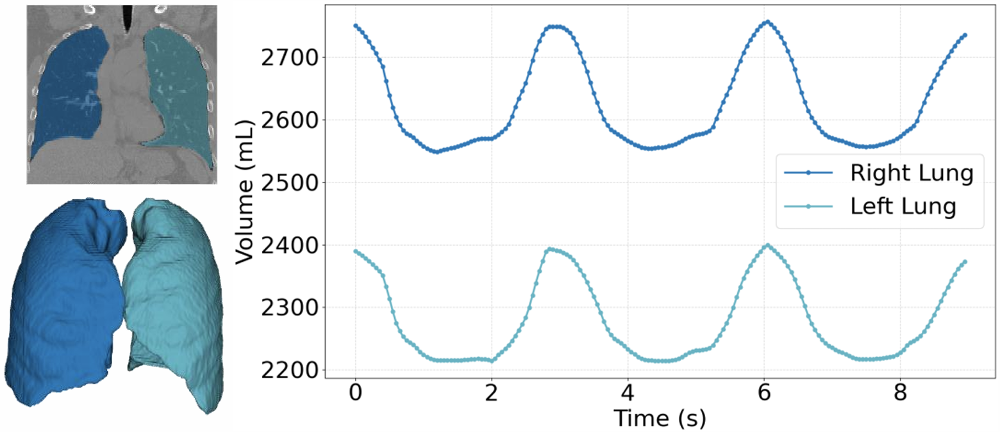

# [ICCV 2025] X2-Gaussian: 4D Radiative Gaussian Splatting for Continuous-time Tomographic Reconstruction

### [Project Page](https://x2-gaussian.github.io/) | [Paper](https://arxiv.org/abs/2503.21779)

<p align="center">
  
  
  
</p>

<p align="center">
  
</p>

<p align="center">
We achieve genuine continuous-time CT reconstruction without phase-binning. The figure illustrates temporal variations of lung volume in 4D CT reconstructed by our X2-Gaussian.
</p>

<p align="center">
  
</p>

<p align="center">
X2-Gaussian demonstrates state-of-the-art reconstruction performance.
</p>

## News

* 2025.10.27: Datasets have been released [here](https://huggingface.co/datasets/vortex778/X2GS). Welcome to have a try!
* 2025.10.17: Training code has been released.
* 2025.06.26: Our work has been accepted to ICCV 2025.
* 2025.03.27: Our paper is available on [arxiv](https://arxiv.org/abs/2503.21779).

## TODO

- [ ] Release more detailed instructions.
- [ ] Release data generation code.
- [ ] Release evaluation code.
- [ ] Release visualizaton code.

## Installation

```sh
# Download code
git clone https://github.com/yuyouxixi/x2-gaussian.git

# Install environment
conda create -n x2_gaussian python=3.9 -y
conda activate x2_gaussian

## You can choose suitable pytorch and cuda versions here on your own.
pip install torch==2.1.2+cu118 torchvision==0.16.2+cu118 --extra-index-url https://download.pytorch.org/whl/cu118
pip install -r requirements.txt
pip install -e x2_gaussian/submodules/simple-knn
## xray-gaussian-rasterization-voxelization is from https://github.com/Ruyi-Zha/r2_gaussian/tree/main/r2_gaussian/submodules/xray-gaussian-rasterization-voxelization
pip install -e x2_gaussian/submodules/xray-gaussian-rasterization-voxelization

# Install TIGRE for data generation and initialization
wget https://github.com/CERN/TIGRE/archive/refs/tags/v2.3.zip
unzip v2.3.zip
pip install TIGRE-2.3/Python --no-build-isolation
```

## Training

### Dtaset

You can download datasets used in our paper [here](https://huggingface.co/datasets/vortex778/X2GS). We use [NAF](https://github.com/Ruyi-Zha/naf_cbct) format data (`*.pickle`) used in [SAX-NeRF](https://github.com/caiyuanhao1998/SAX-NeRF).

### Initialization

We have included initialization files in our dataset. You can skip this step if using our dataset.

For new data, you need to use `initialize_pcd.py` to generate a `*.npy` file which stores the point cloud for Gaussian initialization.

```sh
python initialize_pcd.py --data <path to data>
```

### Start Training

Use `train.py` to train Gaussians. Make sure that the initialization file `*.npy` has been generated.

```sh
# Training
python train.py -s <path to data>

# Example
python train.py -s XXX/*.pickle  
```

## Citation

If you find this work helpful, please consider citing:

```
@article{yu2025x,
  title={X $\^{}$\{$2$\}$ $-Gaussian: 4D Radiative Gaussian Splatting for Continuous-time Tomographic Reconstruction},
  author={Yu, Weihao and Cai, Yuanhao and Zha, Ruyi and Fan, Zhiwen and Li, Chenxin and Yuan, Yixuan},
  journal={arXiv preprint arXiv:2503.21779},
  year={2025}
}
```

## Acknowledgement

Our code is adapted from [R2-Gaussian](https://github.com/Ruyi-Zha/r2_gaussian), [4D Gaussians](https://github.com/hustvl/4DGaussians), [X-Gaussian](https://github.com/caiyuanhao1998/X-Gaussian) and [TIGRE toolbox](https://github.com/CERN/TIGRE.git). We thank the authors for their excellent works.

