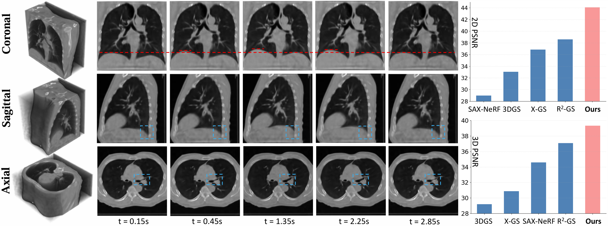

# [ICCV 2025] X2-Gaussian: 4D Radiative Gaussian Splatting for Continuous-time Tomographic Reconstruction

### [Project Page](https://x2-gaussian.github.io/) | [Paper](https://arxiv.org/abs/2503.21779)

<p align="center">
  
  
  
</p>

<p align="center">
  
</p>

<p align="center">
We achieve genuine continuous-time CT reconstruction without phase-binning. The figure illustrates temporal variations of lung volume in 4D CT reconstructed by our X2-Gaussian.
</p>

<p align="center">
  
</p>

<p align="center">
X2-Gaussian demonstrates state-of-the-art reconstruction performance.
</p>

## News

* 2025.10.17: Training code, data, and models have been released. Welcome to have a try!
* 2025.06.26: Our work has been accepted to ICCV 2025.
* 2025.03.27: Our paper is available on [arxiv](https://arxiv.org/abs/2503.21779).

## TODO

- [ ] Release evaluation code.
- [ ] Release visualizaton code.
- [ ] Release more instructions.


## Citation

If you find this work helpful, please consider citing:

```
@article{yu2025x,
  title={X $\^{}$\{$2$\}$ $-Gaussian: 4D Radiative Gaussian Splatting for Continuous-time Tomographic Reconstruction},
  author={Yu, Weihao and Cai, Yuanhao and Zha, Ruyi and Fan, Zhiwen and Li, Chenxin and Yuan, Yixuan},
  journal={arXiv preprint arXiv:2503.21779},
  year={2025}
}
```

## Acknowledgement

Our code is adapted from [R2-Gaussian](https://github.com/Ruyi-Zha/r2_gaussian), [4D Gaussians](https://github.com/hustvl/4DGaussians), [X-Gaussian](https://github.com/caiyuanhao1998/X-Gaussian) and [TIGRE toolbox](https://github.com/CERN/TIGRE.git). We thank the authors for their excellent works.

